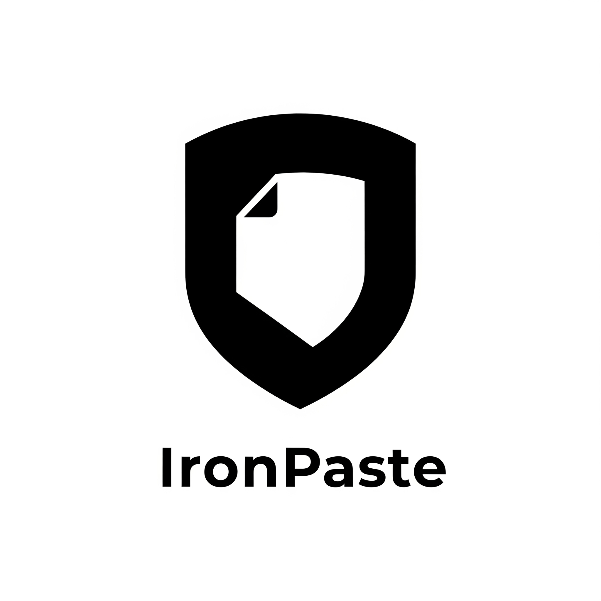

<p align="center">
  
</p>
<h1 align="center">IronPaste</h1>

<p align="center">
    
    
    
  <a href="https://github.com/ClementLG/IronPaste/blob/main/LICENSE">
    
  </a>
</p>

<p align="center">
  <a href="https://www.buymeacoffee.com/clementlg">
    
  </a>
</p>

IronPaste is a simple, secure, and privacy-focused web application for sharing text and code, often known as a "pastebin." It is designed with a strong emphasis on data security and privacy through robust client-side end-to-end encryption.

## ✨ Features

IronPaste allows you to create "pastes"—pieces of text or code—that can be shared via a unique URL. Here are some of its key features:

-   **Client-Side Encryption**: Your pastes can be encrypted directly in your browser before being sent to the server. The server only stores the encrypted data, meaning no one can read the content without the password.
-   **Automatic Expiration**: Pastes can be configured to expire after a specific time or a certain number of reads, ensuring your data doesn't remain accessible forever.
-   **Syntax Highlighting**: Code pastes are automatically highlighted for improved readability, making it easier to share and review code.
-   **Simple API**: A straightforward RESTful API is available for creating and retrieving pastes programmatically.
-   **Dark Mode**: A sleek, modern dark mode is available to reduce eye strain and improve user experience.

## 🛡️ Security

Security is a core principle of IronPaste. Here are the primary security measures implemented:

-   **End-to-End Encryption**: Encryption is performed in the user's browser using the **Web Crypto API (AES-256-GCM)**. The encryption key is derived from the user's password (using **PBKDF2 with 250,000 iterations**) and is never transmitted to the server.
-   **Content Security Policy (CSP)**: A strict CSP is enforced to mitigate cross-site scripting (XSS) attacks.
-   **HTML Sanitization**: All HTML content generated (e.g., for syntax highlighting) is sanitized to prevent XSS attacks.

## 📜 Disclaimer

Anyone who chooses to host an instance of IronPaste is solely responsible for the content uploaded by users. Due to the end-to-end encryption for protected pastes, the server administrator has no technical ability to access or moderate the encrypted content. The developers of IronPaste assume no liability for any content posted on third-party instances. It is the responsibility of the instance administrator to manage their service in accordance with local laws.

##  Installation with Docker

1.  **Clone the repository:**
    ```bash
    git clone https://github.com/ClementLG/IronPaste.git
    cd IronPaste
    ```

2.  **Configure environment variables:**
    Create a `.env` file in the project's root directory. For a production environment, set the following variables:
    ```
    FLASK_CONFIG=production
    SECRET_KEY=a_very_long_and_random_secret_key
    ```

3.  **Launch the application:**
    ```bash
    docker-compose up -d
    ```
    The application will be accessible at `http://localhost:5000`.

### ⚙️ Configuration Variables

The application's behavior is controlled by the following environment variables, which are defined in `config.py`:

-   `FLASK_CONFIG`: The configuration profile to use (`development` or `production`). When using Docker, it is recommended to set this to `production`.
-   `SECRET_KEY`: A secret key used by Flask for signing sessions and other security-related data. **It is crucial to set a long, random, and secret key in production.**
-   `DATABASE_URL`: The connection string for the database. By default, a local SQLite database (`pastes.db`) is used. To use another database like PostgreSQL or MySQL, you must set this variable and install the appropriate driver in the `Dockerfile` and `requirements.txt`. - will be improved in future release

## 📄 License

This project is licensed under the GPLv3 License. See the [LICENSE](LICENSE) file for more details.
